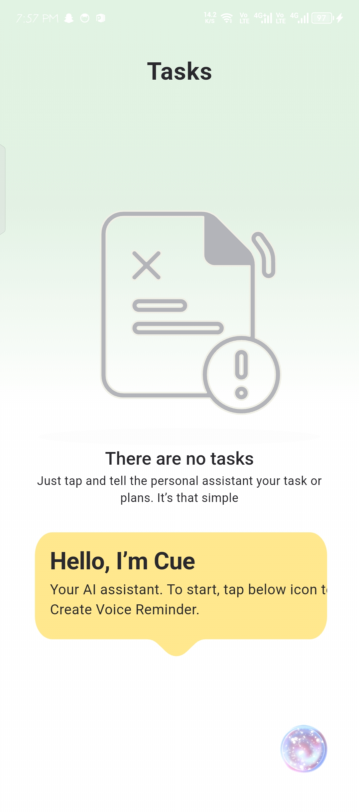
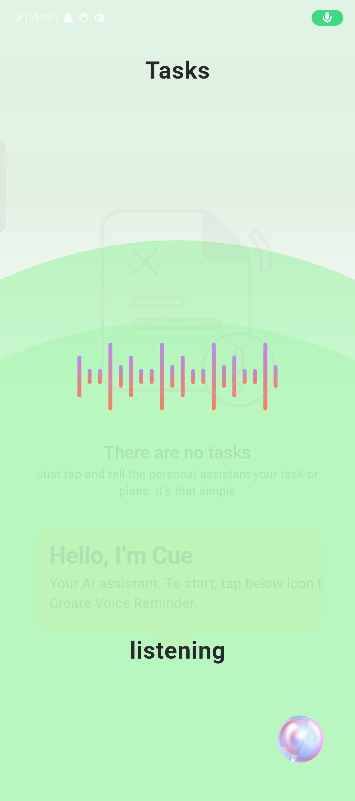
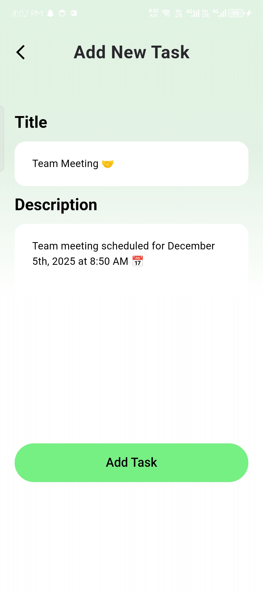
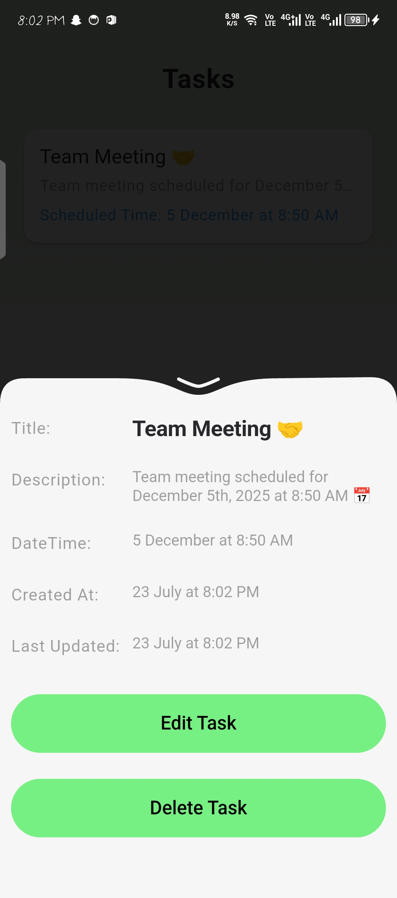

📱 Studio93 Task Manager (Voice-Powered)
Studio93 Task Manager is a voice-powered task management app built in Flutter. It allows users to create, update, and delete tasks manually or using AI voice commands powered by Gemini LLM and Firebase Firestore as a backend database.

✨ Features
✅ Add, update, and delete tasks using Firebase Firestore.

🗣️ AI Voice Command Support:

Tap the mic button to start listening.

Speak naturally (e.g., "Create meeting with team at 5 PM on July 24").

App processes the speech, sends it to Gemini, extracts title, date, time, and description, then shows editable task preview.

🧠 Gemini LLM integration to structure and format user input using a smart prompt.

📝 Tasks can be edited or deleted from:

Swipe actions on list items.

A bottom sheet opened by tapping the task.

🔄 Real-time updates using Firestore.

🔊 Uses speech-to-text to convert voice into structured input.

🧠 How the LLM (Large Language Model) Works
LLM (Large Language Model) refers to AI models like Gemini or ChatGPT that can understand and generate human language.

Flow:
We use the speech_to_text package to capture voice input.

Captured string is formatted and sent to Gemini API.

A detailed custom prompt is used to extract:

date (default to today if not found)

time (converted to 24-hour format)

title with emoji

description with emoji

Gemini responds with structured JSON → parsed into a model.

Pre-filled edit screen shows task info → user can approve or edit it before saving.

Task is saved using the Firebase repository.

🧱 Why I Chose BLoC

Uses Streams which are perfect for reactive UIs and real-time task changes.

Great for separating business logic from UI.

Personally found BLoC intuitive and flexible, especially for managing voice state (listening, processing, complete).

🏗 Setup Instructions
Project is built in Flutter using Firebase Firestore and Gemini API

Clone the Repository:

git clone https://github.com/Usama-Ahmad3/studio93

cd studio93
Install Dependencies:

flutter pub get

Run App:

flutter run

🧠 Gemini Prompt Summary

Extract event information from voice:
- Parse for date, time, title, description.
- Use today’s date if not found.
- Add emojis to title and description.
- Return structured JSON.
  Fallback: If unclear input, Gemini responds with default "Error" task.

🖼 Screenshots

💡 Tech Stack
🧠 Gemini (Generative AI)

🐦 Flutter

🔥 Firebase Firestore

🎙 speech_to_text

🟦 BLoC for state management

🌐 HTTP + Permission handler
